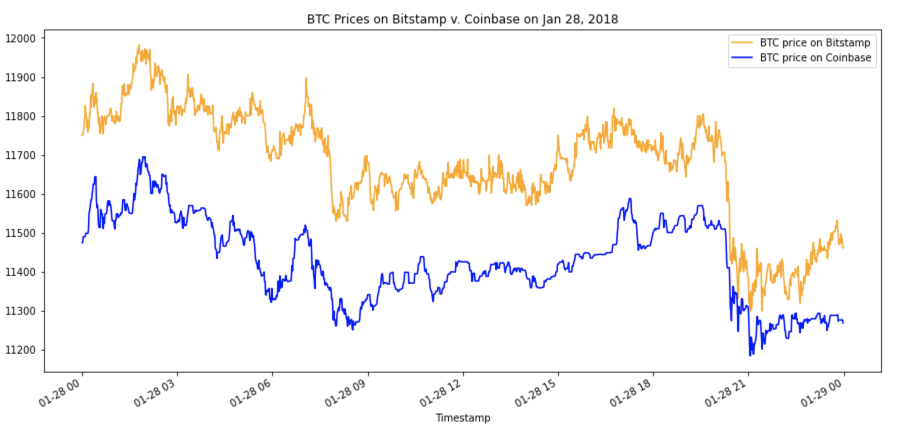

# Crypto Arbitrage

This code analyzes arbitrage opportunities for cryptocurrencies by taking advantage of simultaneous price dislocations in different crypto markets.

The code sorts through historical trade data for Bitcoin on two exchanges: Bitstamp and Coinbase. After collecting and preparing the data, the data is then analyzed to determine if any arbitrage opportunities exist for Bitcoin.

---

## Technologies

This application leverages python 3.7 with the following packages:

* pandas: an open-source library that offers easy-to-use data analysis tools for Python.
* pathlib: for creation of file paths allowing the application to interact with a computer's filesystem.
* %matplotlib: for creating static, animated, and interactive visualizations in Python.

To run this code, first clone the GitHub repo this file is in into your Terminal. Next, to install these packages, while in this same repo in your Terminal, enter `pip install -r requirements.txt`.

---

## Installation Guide

In addition to the normal dependencies above, to run the Crypto Arbitrage code you need to first activate the correct environment by inputting the following command in your terminal:

`conda activate dev`

Next, while in your IDE, open the "crypto_arbitrage.ipynb" notebook file and run the code.

---

## Usage

To begin with, the code imports data into the correct format. Two sources of data are imported into seperate DataFrames: Bitcoin (BTC) prices from Bitstamp, and BTC prices from Coinbase. Both DataFrames include data dating from 01/01/2018 to 03/31/2018.

Next, the data is "cleaned" by dropping all null values, formatting the BTC closing prices into strings, and dropping duplicated values.

The code then creates two new DataFrames (one for each exchange, Bitstamp and Coinbase) that includes only the closing BTC prices. Each of these DataFrame's prices are then plotted over the course of the timeframe and overlayed on top of each other to show visual differences. For example:

Provided there are notable variations between the two exchanges' BTC prices, the code further examines select time periods that show pronounced price variations. The arbitrage spread is then calculated by subtracting the Coinbase lower closing prices from the Bitstamp higher closing prices. Next, statistical summaries and box plots are generated to highlight the extent of the spreads in each selected time period.

Spreads that are negative, or less than zero, are eliminated. Spread returns are then calculated and those that are less than 1% profit are eliminated.

After generating summary statistics, the mean spread returns suggest which time period generated the most arbitrage profit between Bitstamp and Coinbase.

Next, potential profits (in dollars) per arbitrage trade are calcualted for each of the select time periods. These time periods' profits are then plotted.

Finally, cumulative arbitrage profits for each period are summed and plotted.

---

## Contributors

Nicole Roberts,
elle.nicole.roberts@gmail.com

---

## License

[BSD 3](https://choosealicense.com/licenses/bsd-3-clause-clear/): BSD 3-clause is a permissive licence, allowing nearly unlimited freedom with the software as long as BSD copyright and license notice is included.

